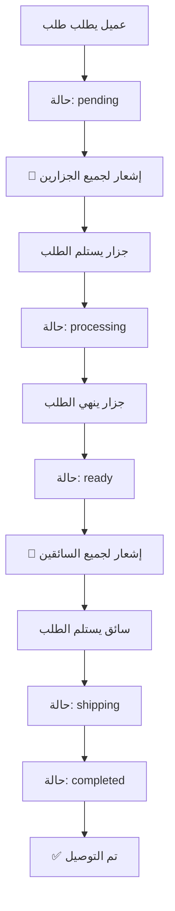

# 🎯 إصلاح نظام توزيع الطلبات - Order Distribution Fix

## المشكلة 🚨

كانت المشاكل التالية موجودة في النظام:

1. **الطلبات لا تصل للجزارين تلقائياً** ❌
   - عند إنشاء طلب جديد، لا يتم إشعار الجزارين
   - الجزارون لا يعلمون بوجود طلبات جديدة

2. **الطلبات لا تُحوّل للتوصيل تلقائياً** ❌
   - عند إنهاء الجزار للطلب، لا يتم تحويله للسائقين
   - السائقون لا يعلمون بالطلبات الجاهزة

## الحل ✅

تم إنشاء نظام آلي بالكامل يعمل على مستوى قاعدة البيانات:

### 1️⃣ إشعارات تلقائية للجزارين
- عند إنشاء طلب جديد → **إشعار فوري لجميع الجزارين**
- الإشعار يتضمن: اسم العميل، إجمالي الطلب، رقم الطلب

### 2️⃣ إشعارات تلقائية للسائقين
- عند تحويل الطلب لحالة `ready` → **إشعار فوري لجميع السائقين**
- الإشعار يتضمن: رقم الطلب، اسم العميل

### 3️⃣ تسجيل الأوقات تلقائياً
- يتم تسجيل وقت بدء المعالجة
- يتم تسجيل وقت جاهزية الطلب
- يتم تسجيل وقت الاستلام والتوصيل

---

## 📁 الملفات المُنشأة

| الملف | الوصف | متى تستخدمه |
|------|-------|-------------|
| **FIX_ORDER_WORKFLOW.sql** | السكريبت الرئيسي | **نفّذه أولاً في Supabase** |
| **QUICK_SUMMARY.md** | ملخص سريع | للمراجعة السريعة |
| **IMPLEMENTATION_STEPS.md** | خطوات التطبيق | دليل خطوة بخطوة |
| **FIX_ORDER_WORKFLOW_README.md** | شرح مفصّل | للفهم العميق |
| **TEST_ORDER_WORKFLOW.sql** | اختبارات شاملة | بعد التنفيذ للتحقق |

---

## 🚀 التطبيق السريع (5 دقائق)

### الخطوة 1: افتح Supabase
1. اذهب إلى: https://supabase.com
2. سجل دخول لمشروعك
3. من القائمة الجانبية → **SQL Editor**

### الخطوة 2: نفّذ السكريبت
1. اضغط **New Query**
2. افتح الملف `FIX_ORDER_WORKFLOW.sql`
3. انسخ محتواه كاملاً
4. الصقه في المحرر
5. اضغط **Run** أو `Ctrl+Enter`

### الخطوة 3: تحقق من النجاح
افتح query جديد ونفّذ:
```sql
SELECT tgname, tgenabled 
FROM pg_trigger 
WHERE tgname LIKE '%butcher%' OR tgname LIKE '%delivery%';
```

**يجب أن ترى 3 triggers:**
- `trg_notify_butchers_new_order`
- `trg_auto_forward_to_delivery`
- `trg_update_processing_timestamps`

### الخطوة 4: اختبر النظام
استخدم الملف `TEST_ORDER_WORKFLOW.sql` للاختبارات

---

## 🔄 سير العمل الجديد



### حالات الطلب

| الحالة | المعنى | من يُشعَر |
|--------|--------|-----------|
| `pending` | طلب جديد | **جميع الجزارين** 🔔 |
| `processing` | قيد المعالجة | - |
| `ready` | جاهز للتوصيل | **جميع السائقين** 🚚 |
| `shipping` | قيد التوصيل | - |
| `arrived` | وصل للعنوان | - |
| `completed` | تم التسليم ✅ | - |

---

## 🧪 الاختبار

### اختبار أساسي
```sql
-- 1. أنشئ طلب تجريبي
INSERT INTO orders (user_id, total, status, customer_name) 
VALUES ('user-id', 100, 'pending', 'اختبار');

-- 2. تحقق من إشعارات الجزارين
SELECT n.title, n.message, u.username as butcher
FROM notifications n
JOIN users u ON n.user_id = u.id
WHERE n.type = 'order'
ORDER BY n.created_at DESC
LIMIT 10;

-- 3. حوّل الطلب إلى ready
UPDATE orders SET status = 'ready' WHERE customer_name = 'اختبار';

-- 4. تحقق من إشعارات السائقين
SELECT n.title, n.message, u.username as driver
FROM notifications n
JOIN users u ON n.user_id = u.id
WHERE n.type = 'delivery'
ORDER BY n.created_at DESC
LIMIT 10;
```

للاختبارات الشاملة: راجع `TEST_ORDER_WORKFLOW.sql`

---

## 🎯 المميزات

### ✅ إشعارات ذكية
- يتم إرسالها لجميع الموظفين المتاحين فقط (غير المحظورين)
- تحتوي على معلومات مفيدة (اسم العميل، إجمالي الطلب)
- مُصنفة حسب النوع (`order`, `delivery`)

### ✅ أداء محسّن
- تم إنشاء indexes لتسريع الاستعلامات
- العمليات تتم على مستوى قاعدة البيانات (أسرع)

### ✅ تتبع كامل
- تسجيل أوقات كل مرحلة
- سهولة تتبع الطلبات
- إمكانية حساب الأداء والإحصائيات

### ✅ نظام مرن
- يعمل تلقائياً بدون تدخل
- سهل الصيانة والتحديث
- متوافق مع النظام الحالي

---

## 📊 الإحصائيات والتقارير

بعد التطبيق، يمكنك الحصول على تقارير مثل:

```sql
-- متوسط وقت معالجة الطلبات
SELECT 
    AVG(EXTRACT(EPOCH FROM (ready_at - processing_started_at))/60) as avg_processing_minutes
FROM orders
WHERE processing_started_at IS NOT NULL 
AND ready_at IS NOT NULL;

-- أسرع جزار في الإنجاز
SELECT 
    u.username,
    COUNT(o.id) as orders_completed,
    AVG(EXTRACT(EPOCH FROM (o.ready_at - o.processing_started_at))/60) as avg_minutes
FROM orders o
JOIN users u ON o.butcher_staff_id = u.id
WHERE o.ready_at IS NOT NULL
GROUP BY u.id, u.username
ORDER BY avg_minutes ASC
LIMIT 10;
```

---

## 🔧 استكشاف الأخطاء

### المشكلة: لا توجد إشعارات

**الحلول:**

1. **تحقق من وجود موظفين:**
```sql
SELECT id, username, role, is_banned 
FROM users 
WHERE role IN ('butcher', 'delivery');
```

2. **تحقق من الـ Triggers:**
```sql
SELECT tgname, tgenabled 
FROM pg_trigger 
WHERE tgrelid = 'orders'::regclass;
```

3. **تحقق من الأذونات (RLS):**
```sql
SELECT * FROM pg_policies 
WHERE tablename = 'notifications';
```

### المشكلة: Trigger لا يعمل

```sql
-- احذف الـ Triggers القديمة
DROP TRIGGER IF EXISTS trg_notify_butchers_new_order ON orders;
DROP TRIGGER IF EXISTS trg_auto_forward_to_delivery ON orders;
DROP TRIGGER IF EXISTS trg_update_processing_timestamps ON orders;

-- ثم أعد تنفيذ FIX_ORDER_WORKFLOW.sql
```

---

## 📞 الدعم

للمزيد من المساعدة:
- **دليل التطبيق:** راجع `IMPLEMENTATION_STEPS.md`
- **الشرح المفصّل:** راجع `FIX_ORDER_WORKFLOW_README.md`
- **الاختبارات:** راجع `TEST_ORDER_WORKFLOW.sql`

---

## ✨ الخلاصة

بعد تطبيق هذا الحل:

- ✅ **الجزارون:** يستلمون إشعارات فورية بالطلبات الجديدة
- ✅ **السائقون:** يستلمون إشعارات فورية بالطلبات الجاهزة
- ✅ **النظام:** يعمل تلقائياً بدون تدخل يدوي
- ✅ **التتبع:** أوقات كل مرحلة مسجلة بدقة
- ✅ **الأداء:** محسّن بالـ indexes والـ queries الذكية

**النظام جاهز للعمل! 🚀**
